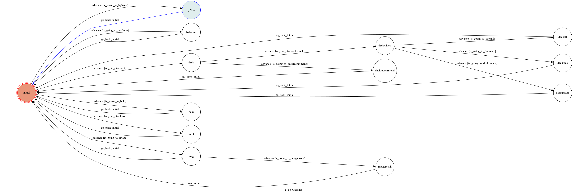

# YuGiOh Bot on Telegram

Source code for YuGiOh bot on Telegram

A telegram bot based on a finite state machine

## Setup

### Prerequisite
* Python 3

#### Install Dependency
```sh
pip install -r requirements.txt
```

* pygraphviz (For visualizing Finite State Machine)
    * [Setup pygraphviz on Ubuntu](http://www.jianshu.com/p/a3da7ecc5303)

### Secret Data

`API_TOKEN` and `WEBHOOK_URL` in app.py **MUST** be set to proper values.
Otherwise, you might not be able to run your code.

### Run Locally
You can either setup https server or using `ngrok` as a proxy.

**`ngrok` would be used in the following instruction**

```sh
ngrok http 5000
```

After that, `ngrok` would generate a https URL.

You should set `WEBHOOK_URL` (in app.py) to `your-https-URL/hook`.

#### Run the sever

```sh
python3 app.py
```

## Finite State Machine


## Usage
一開始的state設在 `initial`.

功能：

1. 找中文卡片→輸入卡號
2. 找日文卡片→輸入日文卡名
3. 查卡圖→/image
4. 找推薦牌組→/deck
5. 用法→/help
6. 最新禁卡表→/limit"

----------

* byNum
	* 輸入卡號
	* Input:`55144522` 
	* 《強欲之壺》
	* 通常魔法
	* 我方抽2張牌。
* byName
	* 輸入日文卡名
	* Input:`死者蘇生`
	* 《死者蘇生》
	* 通常魔法（制限カード）
	* (1)：自分または相手の墓地のモンスター１体を対象として発動できる。
そのモンスターを自分フィールドに特殊召喚する。
* deck
	* Input:`/deck`
	* 要組特定牌組→輸入關鍵字
	* 推薦主流牌組→/recommend
		* Input:`封印`
		* 找全部牌組→/all
		* 找比賽牌組→/race
		* 找非比賽牌組→/norace
* help
	* Input:`/help`
	* 顯示使用說明
* limit
	* Input:`/limit`
	* 回覆最新版禁卡表
* image
	* Input:`/image`
	* 請輸入卡號
		* Input:`83764718`
		* 

## Author
[林偉哲](https://github.com/linpaul2004)
